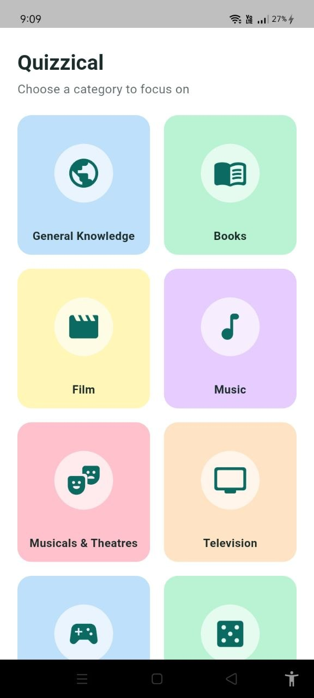
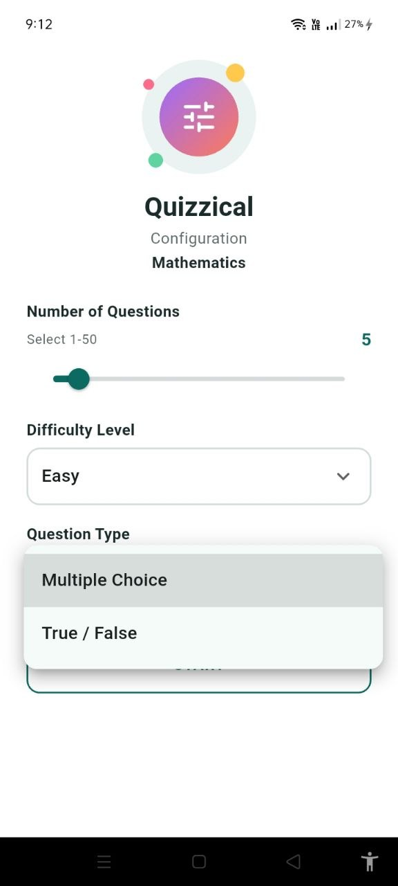
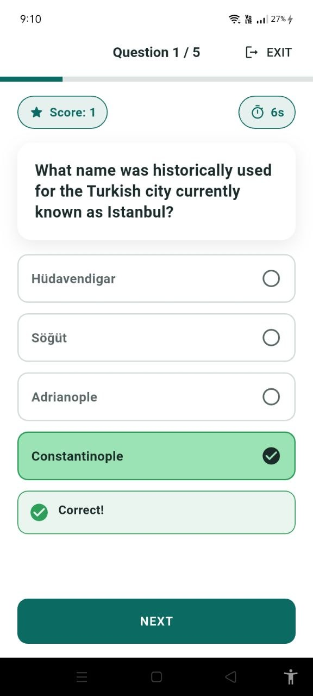
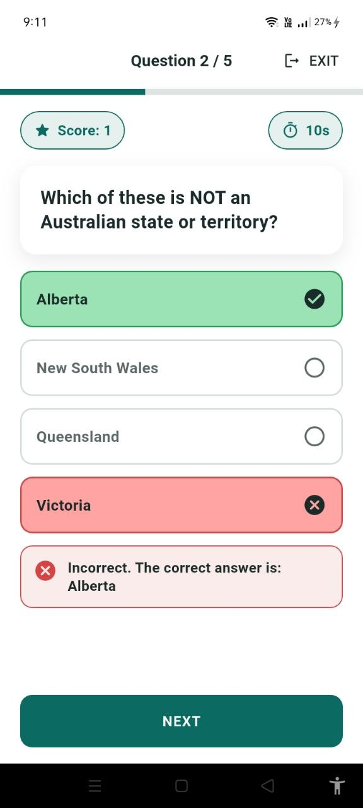
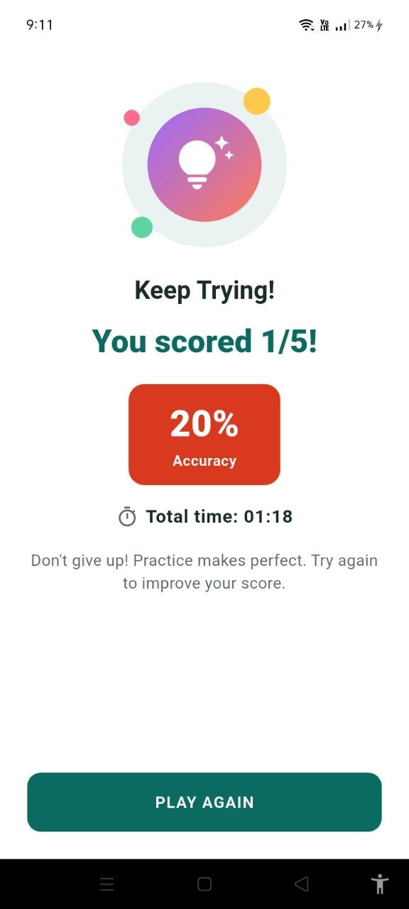

<h1 align="center">❓ Quizzical</h1>

<p align="center">
  A trivia quiz app built with Flutter. Pick a category, set your difficulty, and test your knowledge across 20+ topics powered by the Open Trivia Database.
</p>

<p align="center">
  
  
  
  
</p>

---

## 📖 About

**Quizzical** is a simple, distraction-free trivia app. Choose from over 20 categories, ranging from General Knowledge to Japanese Anime & Manga, configure the quiz to your liking, and get instant feedback with a score summary at the end.

---

## ✨ Features

### 🗂️ Category Selection
- 20+ categories displayed as colorful cards: General Knowledge, Books, Film, Music, Musicals & Theatres, Television, Video Games, Board Games, Science & Nature, Computers, Mathematics, History, Politics, Art, Celebrities, Animals, Vehicles, Comics, Gadgets, Japanese Anime & Manga, Cartoon & Animations

### ⚙️ Quiz Configuration
- Choose the number of questions with a slider (1–50)
- Difficulty level: Any, Easy, Medium, Hard
- Question type: Multiple Choice or True/False

### 📝 Quiz Play
- One question at a time with a live progress bar
- Question counter (e.g. "Question 1/5") and running score
- Countdown timer per question
- Instant feedback: correct answers highlighted in green, incorrect selections in red, with the correct answer revealed
- Exit option available mid-quiz

### 🏆 Results
- Final score (e.g. "You scored 1/5")
- Accuracy percentage
- Total time taken
- Encouraging message based on performance
- Play Again to restart

---

## 📱 Screenshots

<table>
  <tr>
    <td align="center"><b>Home</b><br></td>
    <td align="center"><b>Categories</b><br></td>
    <td align="center"><b>Configuration</b><br></td>
  </tr>
  <tr>
    <td align="center"><b>Quiz Question</b><br></td>
    <td align="center"><b>Answer Feedback</b><br></td>
    <td align="center"><b>Result</b><br></td>
  </tr>
</table>

---

## 🛠️ Tech Stack

| Category | Technology |
|---|---|
| Framework | [Flutter](https://flutter.dev/) |
| Language | [Dart](https://dart.dev/) (SDK `^3.11.1`) |
| State Management | [Provider](https://pub.dev/packages/provider) |
| Networking | [http](https://pub.dev/packages/http) |
| Local Storage | [shared_preferences](https://pub.dev/packages/shared_preferences) |
| HTML Decoding | [html_unescape](https://pub.dev/packages/html_unescape) |
| Trivia Data | [Open Trivia Database API](https://opentdb.com/) |

---

## 🚀 Getting Started

### Prerequisites

- [Flutter SDK](https://docs.flutter.dev/get-started/install) (with Dart `^3.11.1`)
- Android Studio or VS Code with the Flutter extension
- An emulator or a physical device
- An internet connection (quiz questions are fetched live from the Open Trivia Database)

### Installation

**1. Clone the repository**

```bash
git clone https://github.com/<your-username>/quizzical.git
cd quizzical
```

**2. Install dependencies**

```bash
flutter pub get
```

**3. Run the app**

```bash
flutter run
```

### Build an APK

```bash
flutter build apk --release
```

---

## 🗺️ Roadmap

- [ ] Save high scores locally with `shared_preferences`
- [ ] Dark mode
- [ ] Offline question caching
- [ ] Leaderboard / score history screen
- [ ] Sound effects and animations for correct/incorrect answers

---

## 🤝 Contributing

Contributions, issues and feature requests are welcome!

1. Fork the project
2. Create your feature branch: `git checkout -b feature/amazing-feature`
3. Commit your changes: `git commit -m "Add amazing feature"`
4. Push to the branch: `git push origin feature/amazing-feature`
5. Open a Pull Request

---

## 👤 Author

**Sathi Das (Dola)**

- GitHub: [@dasdola](https://github.com/dasdola)
- LinkedIn: [Dola Das](https://www.linkedin.com/in/Dola Das)
- Email: dasdola007@gmail.com

---

## 📄 License

This project is licensed under the MIT License. See the [LICENSE](LICENSE) file for details.

---

<p align="center">Made with ❤️ and Flutter</p>